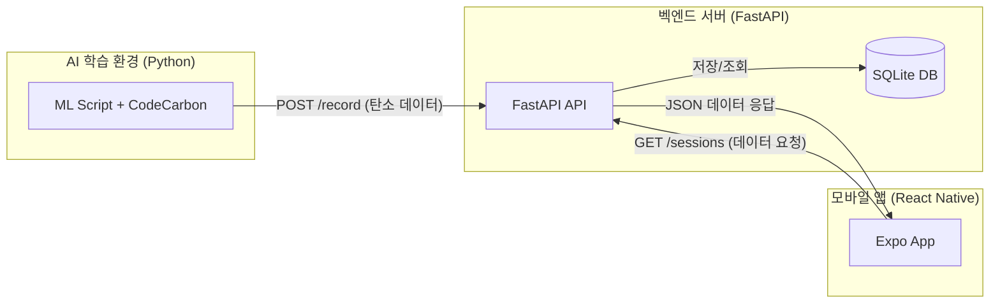

# 🌿 Green-ML 프로젝트 개발 계획 (Plan)

## 1. 프로젝트 개요
AI 모델 학습 시 발생하는 탄소 배출량을 측정하여 '탄소 영수증'을 발행하고, 이를 모바일 앱(React Native)에서 확인 및 최적화할 수 있는 MVP 프로토타입 구현.

## 2. 시스템 아키텍처 & 데이터 흐름


## 3. 폴더 구조 설계 (Directory Structure)
```bash
Green-ML/
├── backend/                # FastAPI 백엔드 서버
│   ├── main.py             # 서버 실행 및 API 엔드포인트
│   ├── database.py         # SQLite & SQLAlchemy DB 설정
│   ├── models.py           # DB 테이블 모델 정의
│   ├── schemas.py          # Pydantic 데이터 검증 클래스
│   └── requirements.txt    # 백엔드 의존성
├── measurement/            # 데이터 수집 (AI 환경 시뮬레이션)
│   ├── dummy_tracker.py    # CodeCarbon 측정 및 데이터 전송 스크립트
│   └── requirements.txt    # 측정기 의존성
├── mobile/                 # React Native (Expo) 프론트엔드
│   ├── src/                # 앱 소스 코드
│   └── App.js              # 네비게이션 및 진입점
└── plan.md                 # 본 개발 계획서
```

## 4. 데이터베이스 스키마 (Proposed)
| 필드명 | 타입 | 설명 |
|---|---|---|
| id | Integer | Primary Key |
| project_name | String | 학습 프로젝트 이름 |
| emissions | Float | 탄소 배출량 (kg CO2-eq) |
| energy_consumed | Float | 에너지 소비량 (kWh) |
| duration | Float | 학습 시간 (sec) |
| timestamp | DateTime | 기록 생성 일시 |

## 5. 5단계 개발 로드맵 (Milestones)

### Phase 1: 백엔드 기초 & 데이터 저장소 구축
- FastAPI 프로젝트 초기화 및 SQLite DB 연동
- 데이터 수집용 `POST /record` 및 조회용 `GET /sessions` API 구현

### Phase 2: 데이터 수집 시뮬레이션 (더미 스크립트)
- `CodeCarbon` 라이브러리를 사용한 측정 시뮬레이션 스크립트 작성
- 측정된 데이터를 백엔드로 전송하고 DB에 저장되는지 확인

### Phase 3: 모바일 프론트엔드 UI 뼈대
- Expo 프로젝트 생성 및 탭 네비게이션 구성
- 대시보드(영수증 UI), 어드바이저, 이력 화면 초기 구성

### Phase 4: Full-Stack 연동 및 통합 테스트
- Ngrok을 활용해 로컬 백엔드를 외부로 개방
- 모바일 앱에서 실제 서버 데이터를 가져와 UI에 바인딩

### Phase 5: 마무리 및 UI/UX 고도화
- 차트 라이브러리 추가 및 탄소 영수증 디자인 고도화
- 최종 발표용 데모 시나리오 점검 및 버그 수정
